```{r setup, include=T, echo=FALSE}
knitr::opts_chunk$set(echo=FALSE, warning=FALSE, message=FALSE, kfigr.prefix=TRUE, kfigr.link=TRUE, comment=NA)


```

# Introduction

## Cocktail-party problem (Cherry, 1953)

How do we recognize what one person is saying when others are speaking at the same time?

When everyone at a well-attended party talks at the same level, the speech of the attended talker at a distance of 0.7 m has a signal-to-noise ratio (SNR) of about 0 dB (the background is as intense as the target talker Plomp 1977). 
This level is sufficient to give adequate intelligibility for listeners with normal hearing (Miller, 1947).

{width=30%}

## Auditory scene analysis
- A critical role of the auditory system is to parse the inputs from the left and right ears into auditory objects - auditory scene analysis. This is an essential role for survival, recognition, and communication.

- Binaural hearing provides cues that allow us to estimate the relative number and location of sources and objects in the environment.

- These cues also help us to estimate the dimensions and characteristics of rooms as well as to hear out speakers in the presence of interfering noise.


{width=50%}

Grothe et al. (2010)

<!-- ##  -->

<!-- >- When the speech sources are spatially separated, normal listeners can perceptually segregate and selectively attend to the source of interest if the sounds arrive from the same location - **spatial release from masking (SRM) ** (Freyman et al., 1999; Brungart, 2001; Freyman -->
<!-- et al., 2001; Hawley et al., 2004) -->


<!-- >- This task is extreamly challenging for listeners with sensorineural hearing loss (with or without hearing aids) or with cochlear implants (Loizou et al., 2009; Marrone et al., 2008). -->


<!-- >- Moreover, listeners with "normal" hearing and elder listeners experience great difficulty when listening in the presence of background noise (Ruggles et al., 2011; Swaminathan et al., 2015; Gallun et al., 2013). -->

<!-- >- Hearing impaired listeners with symmetric binaural hearing often demonstrate reduced SRM primarily due to increased thresholds in spatially separated conditions (Arbogast et al., 2005; Marrone et al., 2008b; Best et al., 2012) -->


## Which features are conveyed by speech sounds?

- Temporal fine structure (TFS)
- Envelope information (ENV)

{width=70%}


## Binaural cues

When listening to sounds, we rely on three mechanisms for both sound localization and auditory scene analysis 

- Interaural level differences (ILDs)
- Interaural time differences (ITDs)
- Interaural coherence

{width=60%}

## Temporal fine structure and envelope ITDs

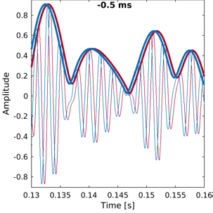  

Why ITDs?

- Speech reception thresholds (SRTs) can **improve up to 10 dB** when sources are separated in space (Hawley et al., 2004).
- Binaural hearing **improves tolerance in reverberating environments** (Harris and Reitz, 1985)
- **Binaural hearing abilities decrease with advancing age**  (Ross, 2008; 2007, Vercammen et al. 2018). 


What about long ITDs?

- Longer ITDs become relevant in reverberation and for integration of multiple sources
- ITDs in the envelope of common amplitude modulation may become the cue for broadband noise stimuli with long ITD (beyond the range for sound localization)
- Robust lateralization has been shown for long ITD of up to 20 ms (only possible below 1500 Hz; (Mossop and Culling, 1998).


<!-- ## Localization using ITDs -->

<!--  -->
<!--  -->

<!-- <li class="fragment" data-fragment-index="2">  -->
<!-- ITDs within the physiological range experienced by human listeners are about ±760 μs; (e.g. Constan and Hartmann (2003) and Hartmann and Macaulay (2014)) </li> -->

<!-- <li class="fragment" data-fragment-index="3"> -->
<!-- ITDs (using fine structure) are useful for frequencies below  1500 Hz -->
<!-- </li> -->

<!-- <li class="fragment" data-fragment-index="4"> -->
<!-- ITDs in the envelope of the signal are also used to determine the location of a source in both lower and higher frequencies. -->
<!-- </li> -->


<!-- ## The precedence effect -->

<!--  -->
<!-- <br> -->
<!-- (Dietz et al. 2013) -->

<!-- <li class="fragment" data-fragment-index="0">  -->
<!-- A single auditory event is perceived at the direction of the first direct wave front (2 and 50 ms later, even when reflections are 10 dB louder) -->
<!-- </li> -->

<!-- <li class="fragment" data-fragment-index="1"> -->
<!-- Asymmetric hearing loss, hearing impairment and ageing negatively affect the precedence effect (Akeroyd and Guy, -->
<!-- 2011). This can only partially restored by hearing aids. -->
<!-- </li> -->
 
<!-- # Binaural processing and speech understanding -->

<!-- ## Binaural Redundancy -->

<!-- - Loudness doubles when the two ears are used instead of one ear for a sound coming from the front of the listener (a single ear would require an increase of about 10 dB; Fletcher and Munson, 1933) -->

<!-- - Just noticeable differences in intensity and frequency improve with signal redundancy -->

<!-- - Speech recognition in the presence of background noise improves (Marrone 2008, Neher 2009) -->

<!-- - Hearing impairment may lead to a slightly weaker binaural benefit in patients  (Dillon, 2001) -->

<!-- - Binaural stimulation sounds can be louder than with a monaural presentation without causing discomfort (even true for CI-treated patient) -->

<!-- ## Binaural Release from Masking (or Binaural Squelch; or Hirsh effect) -->

<!--  -->
<!--  -->

<!-- <li class="fragment" data-fragment-index="2"> Binaural release from masking may improve detection threshold up to about 16 dB for frequencies around 250 Hz and around 3 dB at 1500 Hz </li> -->

<!-- ## Spatial Release from Masking   -->

<!--  -->
<!--  -->

<!-- <li class="fragment" data-fragment-index="2">  -->
<!-- Binaural release from masking may improve detection thresholds up to 12 dB for multiple speech interferers (Jones and Litovsky, 2011), and facilitates source segregation provided that streaming can build up and natural onset cues are present (Drennan, Gatehouse, and Lever, 2003). -->
<!-- </li> -->

<!-- <li class="fragment" data-fragment-index="3">  -->
<!-- Segregation is always better for the combination of both ITDs and ILDs cues (Culling, Hawley, and Litovsky 2004) -->
<!-- </li> -->

<!-- <li class="fragment" data-fragment-index="4">  -->
<!-- A separation of only 10° between two voices is already strong enough to allow segregation  (Brungart and Simpson, 2007). -->
<!-- </li> -->


<!-- <li class="fragment" data-fragment-index="5"> ITD is a critical spatial cue for sound localization and speech perception in noise (Bronkhorst & -->
<!-- Plomp, 1988; Wightman & Kistler, 1992). -->
<!-- </li> -->

<!-- # Autditory Pathway -->

<!-- ## -->


<!-- {width=60%} {width=35%} -->


<!-- ## Auditory pathway -->

<!-- 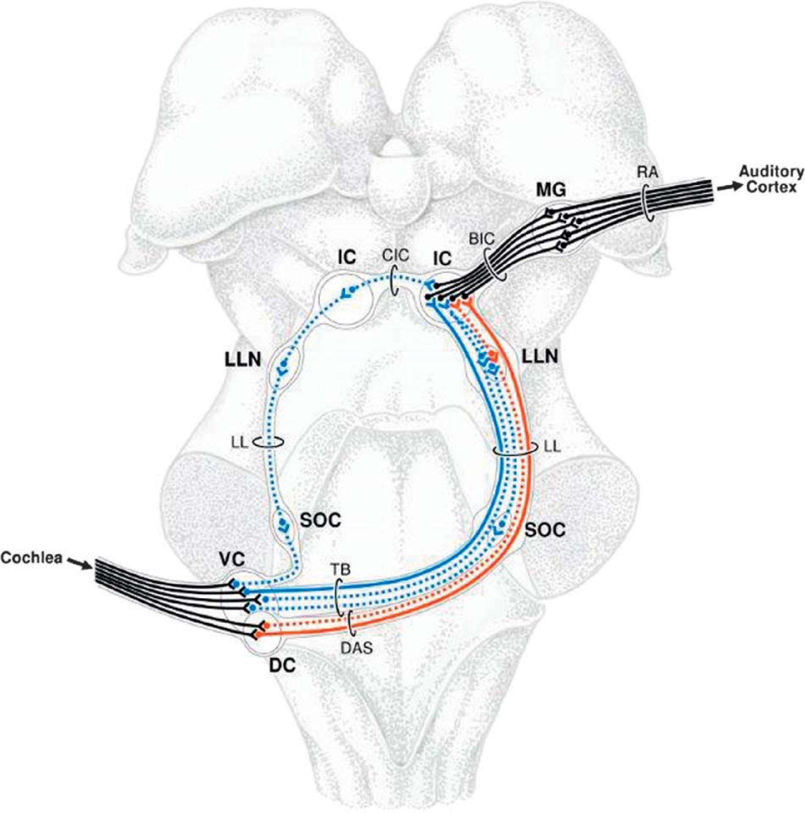{width=50%} -->

<!-- (Amunts, K. et al. 2012) -->


## Aims

The aims of this study are: 

- To assess the neurophysiological basis for envelope encoding of low frequency sounds to sounds with ITDs within and outside the ethological range.
- To evaluate objective measurements of binaural processing using EEG and fNIRS. 
- To infer the underlying mechanisms for ITD processing in human listeners.


<!-- # Neurophysiological binaural processing in humans -->

<!-- ## Electroencephalogram (EEG) -->

<!-- {width=50%} -->
<!--  -->

<!-- (From Luck 2005) -->


# Experiments


## EEG Experiments

{width="60%"}


- Binaural recordings were obtained from 10 NH participants.
- 64 + 2 + 2 channels recording (amplifier: Biosemi ActiveTwo system).
- Fs: 16384 kHz / 24 bits (Low-pass: 3 kHz)
- Denoising source separation (DSS)
- Hottelling T2 test for individual analysis
 

## Methods

Objective measures of binaural processing can be obtained by using stimuli where the temporal structure is manipulated so that the perceived location of the sound image changes periodically (e.g. 6.7 Hz) over time. 

{width=55%}


- Stimuli consisted of narrow-bandpass noise (300 - 700 Hz) at 75 dB SPL

## Methods

- By switching the "sound image" from left to right at 6.7 Hz, a strong steady-state response is evoked at that particular frequency

- ITMs: −0.5/ + 0.5 ms, −1.0/ + 1.0 ms, −1.5/ + 1.5 ms, −2.0/ + 2.0 ms, −2.5/ + 2.5 ms, −3.0/ + 3.0 ms, −4.0/ + 4.0 ms


<ul class="fragment" data-fragment-index="1" style="text-align: center">
<video width="320" height="240" controls source src="./figures/example0.5_-0.5.mp4" type="video/mp4">
</ul>


<!-- ## Neural representation of asymmetric interaural time modulations (ITMs) -->

<!-- - ITMs: 0/ + 0.5 ms, 0/ + 1.5 ms, 0/ + 2.0 ms, 0/ + 3.0 ms, 0/ + 4.0 ms. -->

<!-- 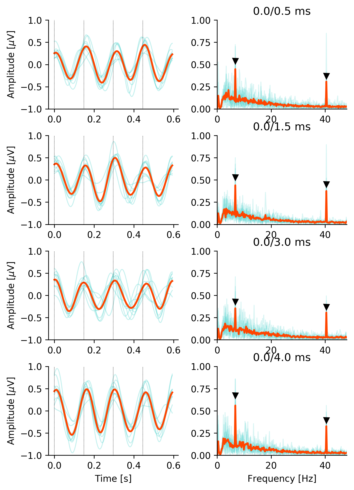 -->
<!-- 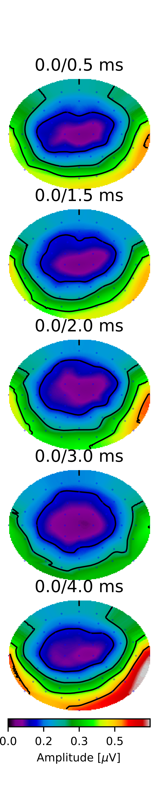 -->


<!-- ##  -->

<!--  -->
<!--  -->


<!-- # Testing the independence of ITD detectors -->

<!-- ## -->
<!-- - ITMs: −0.5/ + 0.5 ms -->

<!--  -->
<!-- 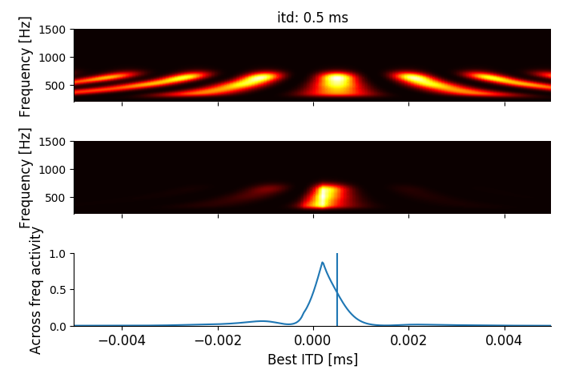 -->

<!-- - the ITM between −0.5 ms and −0.5 ms should be less adapted (different neural activation) -->

<!-- ## -->
<!-- - ITMs: −0.5/ + 1.5 ms -->

<!--  -->
<!--  -->

<!-- - the ITM between −0.5 ms and 1.5 ms should be more adapted (common neural activation) -->

<!-- ## -->
<!-- - ITMs: +0.5/ + 1.5 ms. -->

<!--  -->
<!--  -->

<!-- - the ITM between +0.5 ms and +1.5 ms should be less adapted (different neural activation) -->


<!-- ## Results  -->

<!-- <div class="column" style="float:left; width:50%; text-align: center"> -->
<!--  -->
<!-- </div> -->

<!-- <div class="column" style="float:right; width:50%; text-align: center"> -->
<!--  -->
<!-- </div> -->

<!-- 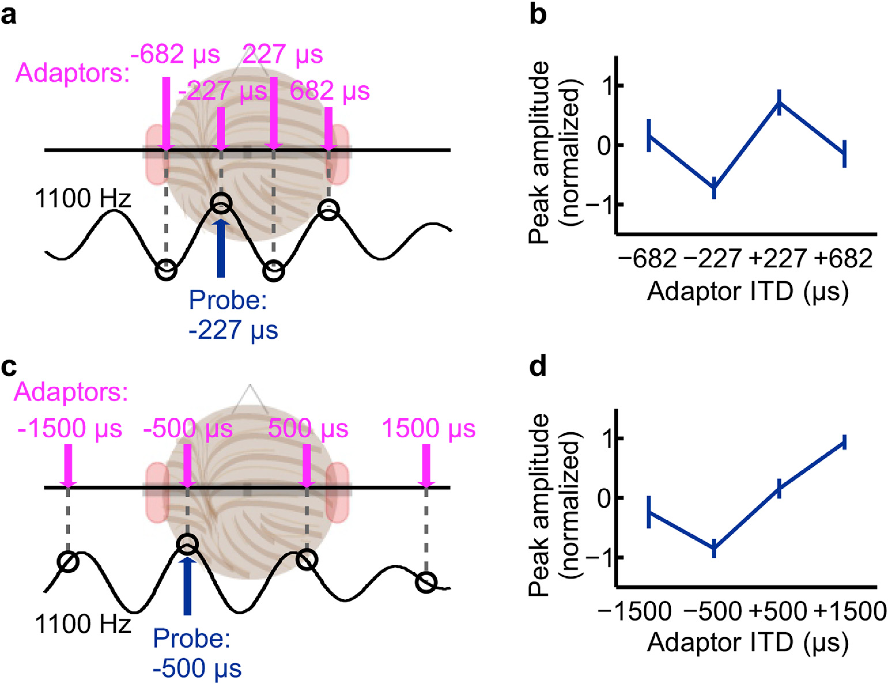 -->
<!-- <br> -->
<!-- Salminen et al. 2018 -->

## Neural representation of symmetric ITMs

{width=50%} 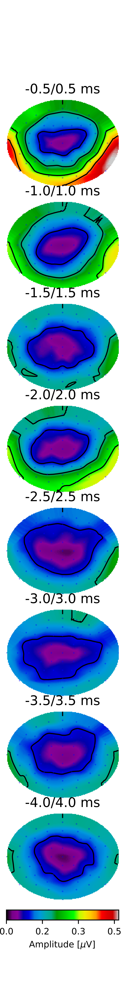{width=8.2%}


## Neural representation of symmetric ITMs

- ITMs: −0.5/ + 0.5 ms, −1.0/ + 1.0 ms, −1.5/ + 1.5 ms, −2.0/ + 2.0 ms, −2.5/ + 2.5 ms, −3.0/ + 3.0 ms, −4.0/ + 4.0 ms

{width=50%} {width=33%} 

- Significant effect of the ITM (F(7,56.4) = 6.6, p < 0.001).


# FNIRs Experiment

## Functional near-infrared spectroscopy (fNIRS)


- Neuroimaging technique for measuring brain activity.
- It uses light to measures the change in concentration of haemoglobin in blood: a proxy measure of total local neural activity (similar to fMRI).


{width=20%} {width=20%} 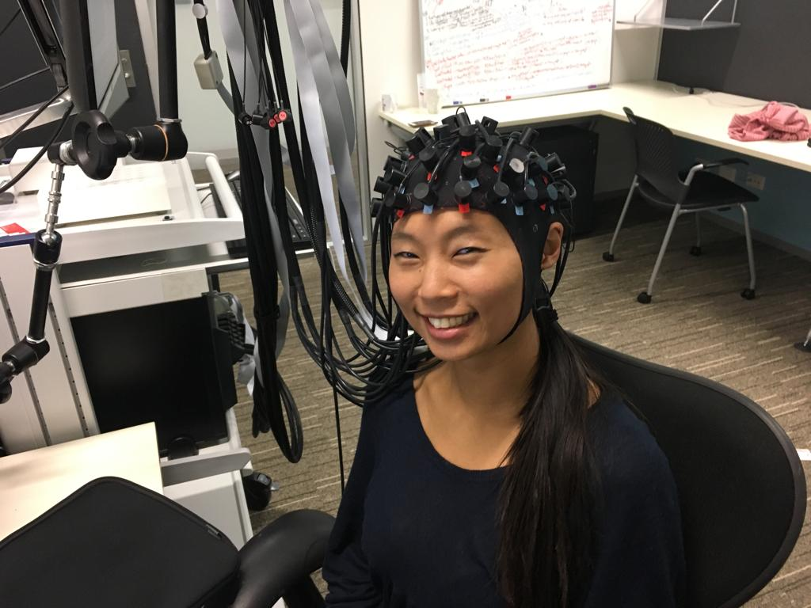{width=20%} {width=20%}


- The brain needs oxygen to function. Blood carries oxygen to the brain as fuel for your neurons. 
 
- When a region of the brain requires more energy, additional oxygenated blood is pumped to the area.

- As the brain uses oxygen, haemoglobin (carrying O2) gets de-oxygenated (it turns bluish). 
 
- fNIRs provides an estimation of oxygenated and de-oxygenated levels which is used as proxy measurement for brain activity.

## Methods

- 10 Participants
- Same ITMs as in EEG: −0.5/ + 0.5 ms, −1.0/ + 1.0 ms, −1.5/ + 1.5 ms, −2.0/ + 2.0 ms, −2.5/ + 2.5 ms, −3.0/ + 3.0 ms, −4.0/ + 4.0 ms **(6.7 Hz)**
- Stimuli consisted of narrow-bandpass noise (300 - 700 Hz) at 75 dB SPL
- fNIRs were elicited by presenting 25 trials of 6 seconds separated by 15-30 s of silence.
- 16 LED light sources and 16 avalanche photo-diode light detectors (NIRScout, NIRX, Germany)
- Fs: 7 Hz


## Results 

{width=30%} {width=50%}


## Results 

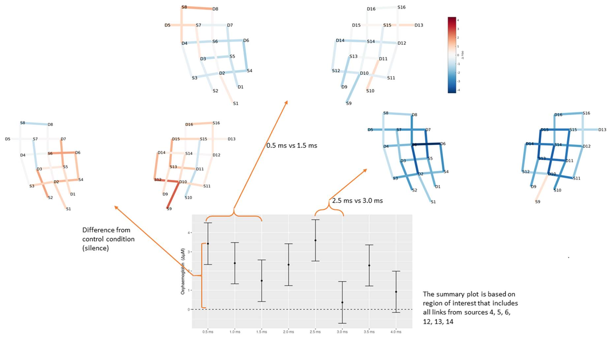{width=100%}

## EEG and fNIRS

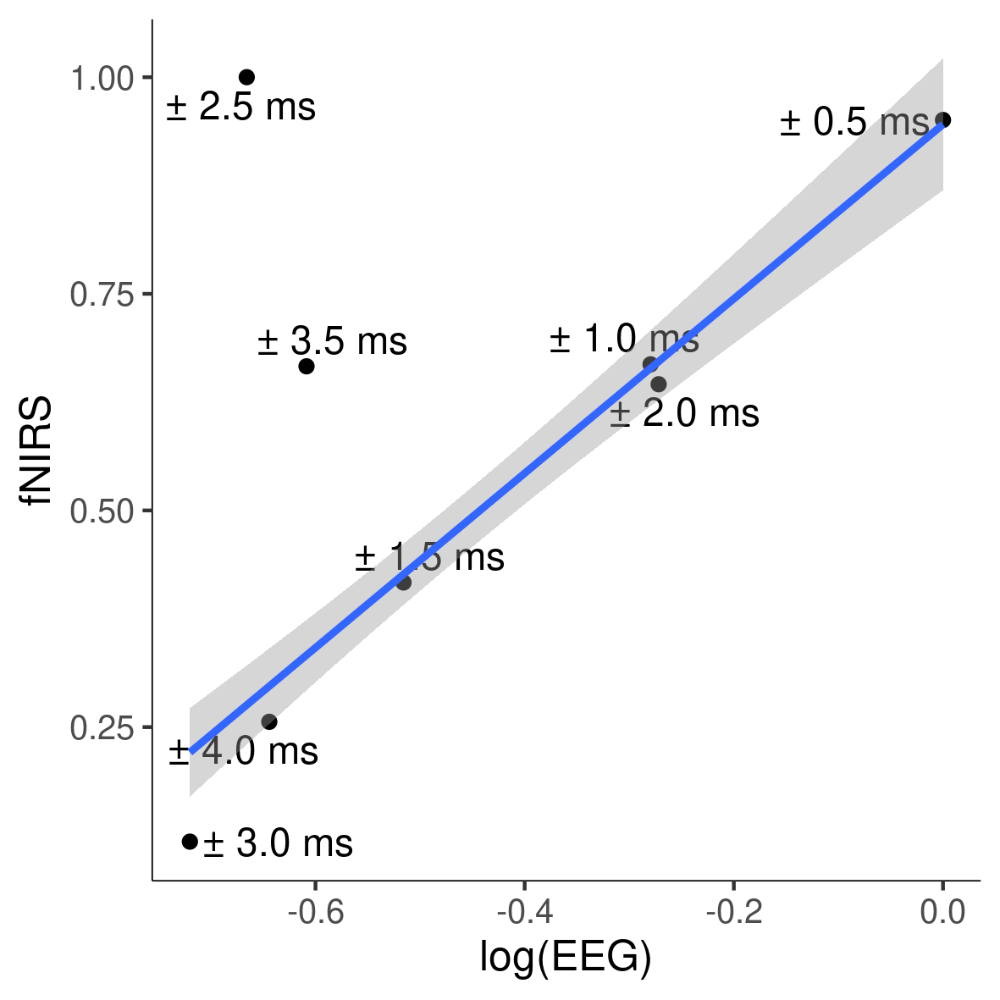{width=50%}

<!-- ## Results -->

<!-- - The damping pattern may result by the trade-off between conflicting envelope and fine structure ITD.  -->
<!-- Whilst the envelope has a consistent ITD across all conditions, the interaural phase difference (IPD) of the 500 Hz carrier does not. -->
<!-- </div> -->

<!-- <div class="column" style="float:left; width:60%; text-align: left"> -->
<!--  -->
<!-- 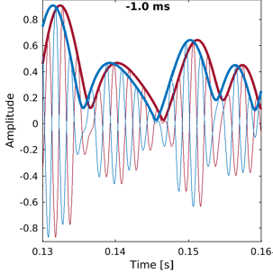 -->

<!-- 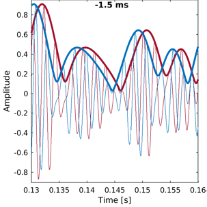 -->
<!--  -->
<!-- </div> -->


<!-- <li class="fragment" data-fragment-index="1"> -->
<!-- At −0.5/ + 0.5 ms (−90 ◦ / 90 ◦ IPD), the IPD of the centre frequency is consistent with the envelope ITD. -->
<!-- </li> -->

<!-- <li class="fragment" data-fragment-index="2"> -->
<!-- At −1.0/ + 1.0 ms (−180 ◦ / 180 ◦ IPD), the IPD of the centre frequency is ambiguous. -->
<!-- </li> -->

<!-- <li class="fragment" data-fragment-index="3"> -->
<!-- At −1.5/ + 1.5 ms (−270 ◦ / 270 ◦ IPD), the IPD of the centre frequency is conflicting with the envelope ITD, i.e. the fine structure IPD leads in the right ear whilst the envelope ITD leads on the left ear. -->
<!-- </li> -->

<!-- <li class="fragment" data-fragment-index="4"> -->
<!-- At −2.0/ + 2.0 ms (−360 ◦ / 360 ◦ IPD), there is not IPD in the fine structure at the centre frequency, and so no conflicting cues. -->
<!-- </li> -->


<!-- ## Neural representation from a model -->

<!-- <div class="column" style="float:left; width:50%; text-align: right"> -->
<!--  -->
<!-- <br> -->
<!-- Activation difference using Salminen  $\pi$-limit -->

<!--  -->
<!-- <br> -->
<!-- Activation difference using Salminen  $\pi$-limit -->
<!-- </div> -->


<!-- <div class="column" style="float:right; width:50%; text-align: center"> -->
<!-- 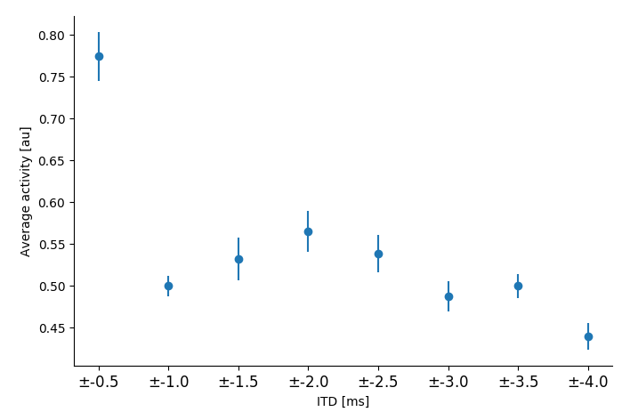 -->
<!-- <br> -->
<!-- Activation difference my data (rms) activity $\pi$-limit -->
<!-- </div> -->


<!-- ## Predicted average neural activity -->

<!-- <div class="column" style="float:left; width:45%; text-align: right"> -->
<!--  -->
<!-- <br> -->
<!-- Average activity $\pi$-limit (stimuli leading on left) -->
<!-- <br> -->
<!--  -->
<!-- <br> -->
<!-- Activation difference (rms) activity $\pi$-limit -->
<!-- </div> -->


<!-- <div class="column" style="float:right; width:45%; text-align: right"> -->
<!--  -->
<!-- <br> -->
<!-- Average activity central weighting (stimuli leading on left) -->
<!-- <br> -->
<!--  -->
<!-- <br> -->
<!-- Activation difference (rms) central weighting -->
<!-- </div> -->


<!-- ## -->

<!--  -->


## Conclusions 

> - EEG responses to ITMs could be reliable recorded from all participants across conditions.
> - fNIRs responses to ITMs are only clear at group level.
> - Both, EEG and fNIRs show a similar ITMs damping function pattern to long ITDs. 
> - The damping function may reflect the interaction between two neural mechanisms interacting (TFS and ENV ITDs)


## Acknowledgments

- Australian Research Council [project number FL160100108]
- Thanks to you for "listening"

Australian Research Council (FL160100108)

Collaborators 

{width=20%}  {width=19.5%}


{width=40%}  

<!-- ## References -->